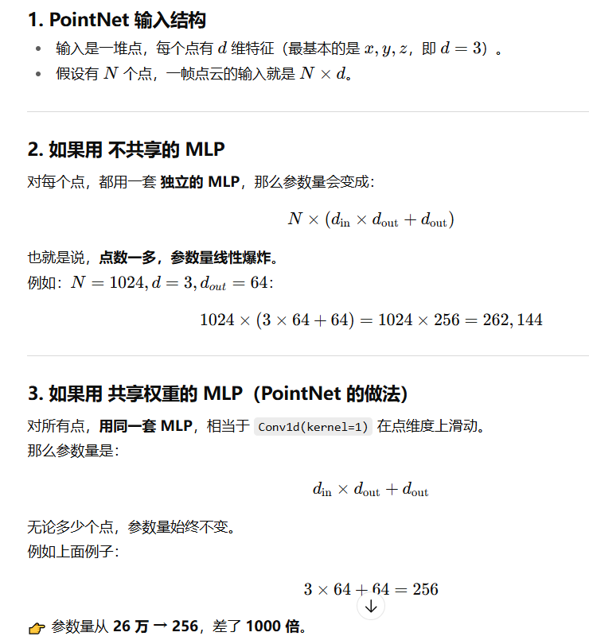

## AI 基础篇

### 监督/全监督/半监督/弱监督

### 卷积的作用？

1. 局部连接。比起全连接，局部连接会大大减少网络的参数。
2. 权值共享。参数共享也能减少整体参数量。一个卷积核的参数权重被整张图片共享，不会因为图像内位置的不同而改变卷积核内的参数权重。
3. 下采样。下采样能逐渐降低图像分辨率，使得计算资源耗费变少，加速模型训练，也能有效控制过拟合。

### Norm/BN 的作用：

神经网络因为是一堆矩阵运算（线性变换）和非线性变化（Relu）的堆叠。
如果 W、b 初始化得不合适，或者上一层输出分布本身不稳定，下一层的输入可能均值飘移或方差过大/过小。（特别是在网络初始的阶段）一层层叠加后，分布会逐渐“失控”。这就是所谓的内部协变量偏移。
N 把输入“拉回”到一个合适的范围（大约均值 0，方差 1），这样能保证梯度比较稳定，也可以帮助收敛。（为什么能帮助收敛？）但是对 BN 对小 batch 的效果不好，所以 Trans 里面会用 LayerNorm。

> 顺序：输入 → 卷积/全连接 → BN → ReLU → 下一层 （要先归一化再输入 ReLU）

#### BatchNorm

将当前批次所有数据的具有相同通道索引的特征图划分为一组，每组单独归一化，这样组集合就是（NxC1xHxW）一组。

#### LayerNorm

将当前批次单个数据的所有通道的特征图划分为一组，每组单独归一化，这样组集合就是（N1xCxHxW）一组。

### CNN 的典型输出：

（NxCxHxW）：
batch size x Channel x Hight x Width
(32 x 3 x 1024 x 768)（例子，假设一个 batch 输入 32 张图片）

### 正则化：

#### L2 正则化：

```bash
optimizer = torch.optim.SGD(model.parameters(), lr=0.1, weight_decay=1e-4)
```

这里的 weight decay 实际上就是正则化，作用是防止特别依赖某个权重，惩罚较大的权重。

#### Dropout：

· 训练时随机把一部分神经元“丢掉”（置 0），以概率 𝑝 保留。

· 推理时不丢弃，而是用缩放的权重。

· 本质：引入随机性，让模型不能过度依赖某些神经元 → 起到正则化效果。
可以在全连接层中使用

```bash
        # 全连接层
        self.flatten = nn.Flatten()
        self.fc1 = fc_with_initialize(1024 * 4 * 4, 2048)
        self.bn_fc1 = nn.BatchNorm1d(num_features=2048)
        self.dropout_fc1 = nn.Dropout(0.5)
        self.fc2 = fc_with_initialize(2048, 1024)
        self.bn_fc2 = nn.BatchNorm1d(num_features=1024)
        self.dropout_fc2 = nn.Dropout(0.6)
        self.fc3 = fc_with_initialize(1024, self.num_class)
```

· 没有 Dropout 时，某些神经元可能“绑在一起”工作，过分依赖彼此。通过 Dropout 随机屏蔽掉一些神经元，迫使其他神经元也要学到有用的特征。

· 在 Dropout 每一轮训练过程中随机丢失神经元的操作相当于多个模型进行取平均，因此用于预测时具有 vote 的效果。

> 一个神经元同时包含了输入，权重，偏置和其激活函数，所谓神经元激活不激活是由激活函数决定的

### 过拟合与欠拟合

**欠拟合**
· 模型太简单，不能捕捉数据规律，训练集表现就很差。

· 训练误差高，测试误差也高。

原因可能是：

模型容量不足（比如用线性模型拟合非线性数据）。

特征不够（没包含关键特征）。

**过拟合**
· 模型太复杂，在训练集上表现很好，但泛化到测试集很差。
· 训练误差低，测试误差高。

可以使用：
· 增加数据量（收集更多样本 / 数据增强）。

· 加强正则化（L1/L2、Dropout、BN）。

· 提前停止训练 (Early Stopping)。

· 减小模型复杂度。

### 损失函数

### 激活函数

#### Sigmoid

$\sigma(x) = \frac{1}{1+e^{-x}}$

**优点**

· 好像就只有输出范围是 0 到 1 了
**缺点**

· 计算量大（有幂）

· Sigmoid 的导数范围是 0 到 0.25，x 过大和过小都容易让导数接近于 0

· 输出不是 0 均值，导致网络加深会改变数据的分布

#### tanh

$\tanh(x) = \frac{e^x - e^{-x}}{e^x + e^{-x}}$
**优点**

· 解决了均值不是 0 的问题

· 靠近 0 点时导数值比 sigmoid 大，收敛快一些
**缺点**

· 计算量还是大

· 梯度消失问题依旧存在

#### ReLU（我的个人项目里是这样的）

$\text{ReLU}(x) = \max(0, x)$
**优点**

· 计算速度很快，非线性函数

· 激活输出为正时，导数为 1，缓解了梯度消失

· 为负时，使得神经元变得稀疏，感觉有点像正则化，防止了部分噪声引入。
**缺点**

· ReLU 也不是 zero-centered 的

· 使得神经元部分死亡，让部分神经元可能无法更新

#### Leaky ReLU（CNN 里常用）

$\text{LeakyReLU}(x) = \begin{cases}x, & x \geq 0 \\ \alpha x, & x < 0\end{cases}$
**优点**

· 在 ReLU 基础上防止了神经元死亡问题
**缺点**

· 网络稀疏性更差

· 引入了额外的超参数

· 相对来讲更贴近 0 均值

#### GELU（公式有点复杂）

**优点**

· 兼具稀疏性和概率性

· Trans/BERT 中经常使用

#### Softmax（勉强也算激活函数吧！实在不知道分到哪）

可以把 logit 映射到和为 1 的一个概率上，所以很适合多分类问题。

**不过现代 DL 主要还是追求防止梯度消失和爆炸问题，0 均值只是让收敛速度更慢一些**

### 优化器

**梯度理解**
神经网络的损失函数是一个多元函数，相当于网络在一个很高维度的空间寻找梯度。
一元函数，要么正要么负方向。但在高位空间就是一个找一个方向高维向量了。

在更新时，每个参数都拥有自己的偏导数分量，一起构成某个“最好的梯度向量”，因此更新一次梯度会牵扯到几乎所有参数。（类似于空间中多个向量合成为一个向量，某个更新方向实际上也是有多个参数组成的，有些参数梯度大，有些参数梯度小）

#### 1.SGD

$$
\theta_{t+1} = \theta_t - \eta \nabla_\theta J(\theta_t; x^{(i)}, y^{(i)})
$$

· 最简单最经典
· 收敛慢容易震荡

#### 2. SGD with Momentum

$$
v_t = \beta v_{t-1} + (1-\beta)\nabla_\theta J(\theta_t)
$$

$$
\theta_{t+1} = \theta_t - \eta v_t
$$

· 更新方向是历史梯度的指数加权平均，而不是单点的梯度。
· 有助于提高收敛速度

#### 3.Adam

AdaGrad：对每个参数都单独设置学习率，并且加入一个历史梯度

$$
m_t = \beta_1 m_{t-1} + (1-\beta_1)\nabla_\theta J(\theta_t)
$$

$$
v_t = \beta_2 v_{t-1} + (1-\beta_2)(\nabla_\theta J(\theta_t))^2
$$

$$
\hat{m}_t = \frac{m_t}{1-\beta_1^t}, \quad \hat{v}_t = \frac{v_t}{1-\beta_2^t}
$$

$$
\theta_{t+1} = \theta_t - \frac{\eta}{\sqrt{\hat{v}_t}+\epsilon} \hat{m}_t
$$

$$
\theta_{t+1} = \theta_t - \eta \Bigg( \frac{\hat{m}_t}{\sqrt{\hat{v}_t}+\epsilon} + \lambda \theta_t \Bigg)
$$

### 数据增强

数据增强流水线，torchvision 等等（我的自制视频里面有讲到）

### Transformer Attention 和 ViT

### ResNet 和瓶颈块结构

什么都不学（参数趋近于 0）”比“精确学出恒等映射”更自然。
解决深层网络的退化问题和梯度消失爆炸问题。

直接把上面一层跳跃连接到这一层的输出，如果自己没学到什么，至少上一层的 x 还在，不会自己“搞砸”

#### 手搓瓶颈块？

```bash
import torch
import torch.nn as nn

class Bottleneck(nn.Module):
    expansion = 4  # 输出通道是中间通道的 4 倍

    def __init__(self, in_channels, out_channels, stride=1, downsample=None):
        super(Bottleneck, self).__init__()

        # 1x1 卷积 降维
        self.conv1 = nn.Conv2d(in_channels, out_channels, kernel_size=1, bias=False)
        self.bn1 = nn.BatchNorm2d(out_channels)

        # 3x3 卷积 提取特征
        self.conv2 = nn.Conv2d(out_channels, out_channels, kernel_size=3, stride=stride,
                               padding=1, bias=False)
        self.bn2 = nn.BatchNorm2d(out_channels)

        # 1x1 卷积 升维
        self.conv3 = nn.Conv2d(out_channels, out_channels * self.expansion, kernel_size=1, bias=False)
        self.bn3 = nn.BatchNorm2d(out_channels * self.expansion)

        # 残差支路（可能需要下采样保证维度一致）
        self.downsample = downsample
        self.relu = nn.ReLU(inplace=True)

    def forward(self, x):
        identity = x

        out = self.conv1(x)
        out = self.bn1(out)
        out = self.relu(out)

        out = self.conv2(out)
        out = self.bn2(out)
        out = self.relu(out)

        out = self.conv3(out)
        out = self.bn3(out)

        # shortcut 分支
        if self.downsample is not None:
            identity = self.downsample(x)

        out += identity
        out = self.relu(out)

        return out
```

需要注意捷径链接里的 downsample，如果通 道/高宽不一致，需要对应。
通常是以下函数来改变捷径链接的通道：

```bash
nn.Sequential(
    nn.Conv2d(in_channels, out_channels, kernel_size=1, stride=stride, bias=False),
    nn.BatchNorm2d(out_channels)
)

```

## 池化层有几种？

## 目标检测与计算机视觉

### 你能手搓 LeNet 吗？

### 各个边缘检测算子的区别？

### 单阶段检测和双阶段

### 各个正确率指标

### 卡尔曼滤波

### YOLOv7 和 YOLOv5 的区别，为什么你使用了 YOLOv7？

## 3D 感知基础

### 激光雷达原理

激光雷达发射高密度的激光束，光束沿直行传播打到物体的表面，然后以相同的方向反射回去（忽略少量光线发生衍射现象），反射回去的光线由光电探测器（光敏传感器）检测收集，结合激光束往返传播的距离与方向信息就可以生成物体的 3D 几何形状。实际在使用过程中，激光发射器置于连续旋转的底座上，从而使得发射的激光束能以不同方向到达物体表面（前、后、左、右）。

### PointRCNN 架构理解

### ICP 配准

### RANSAC

### PointNet


### BEV

### KPConv
